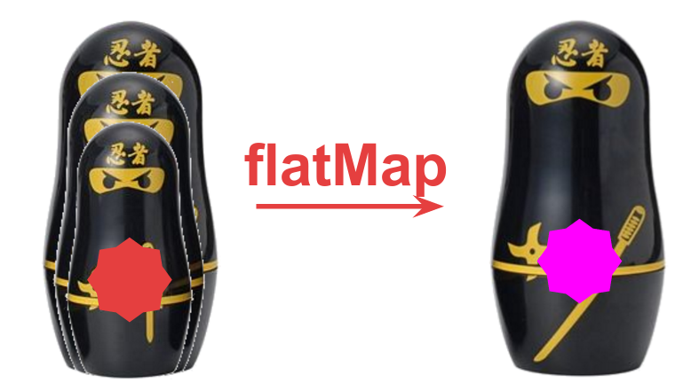

## The m***d word

This is a place where a lot of developers feel quite uncomfortable.
Monads became a mythological creature in few last years while the actual concept is quite easy and
surprisingly a lot of people use them not knowing it. There is a high chance that you used Doctrine collections.
Doctrine ArrayCollection does not fulfill all requirements so it could be called a monad implementation but it's
not so far away from PhpSlang collections library.
One of popular use cases for popular monad can be also a promise
which is widely used by JavaScript community. Promises are not a best example of monad, but a difference between
Promise and Future is subtle.

## Monads as matrioshkas

Let's imagine that a monad is a mathematical construct very similar to matioshka.
For now let's think only about it that it's some container for ANY kind of content.
It does'nt matter why we want to wrap something with a monad - we'll go back to it later.

Monad has this nice feature that it can change a shape of an object that it contains.
So let's imagine that a red symbol inside a matrioshka on a left side is a strawberry dumpling.
We're going to use a *map()* function to transform this strwaberry dumpling into a dumpling with blueberries.

There is one more similarity between monads and matioshkas.
Because a monad can contain ANY other object inside it - there is no reason why we would not want
to place one monad inside another. And this is something that happens in a purely functional code
quite often. On the other hand - You usually want to have as simple structure as it's possible,
so monads are not only composable (with some limitations), but they also can be flattened.

One little think that you have to keep in mind is that monad is just a concept. It can be called a design pattern for
mathematicians, but it does'nt do anything on it's own. There are many different kinds of monads. Example displayed
above applies only to nested monads of one kind. When you have nested monads of different kinds you can't flatten them.

## Monad examples

PhpSlang provides the most popular monads used very often in Haskell/Scala world and few other tools that make using of
those monads more convenient.
Most crucial monads are:
 - [Option](../01_Usage/01_Essentials/03_Option.md) - allows you to semantically wrap non-/existence
 - [Either](../01_Usage/01_Essentials/04_Either.md) - semantic wrapper for result of one of two types
 - [Future](../01_Usage/01_Essentials/06_Future.md) - for very clean and easy to maintain parallelism
 - [Collection](../01_Usage/04_Immutable_Data_Structures/01_Overview.md) - yes collections are monads as well and you can do a lot with them

## Resources
Here are some great resources if you want to have a bigger picture:
- [Functors, Applicatives, And Monads In Pictures](http://adit.io/posts/2013-04-17-functors,_applicatives,_and_monads_in_pictures.html)
- [Brian Beckman: Don't fear the Monad](https://www.youtube.com/watch?v=ZhuHCtR3xq8)
- [Monads: Programmer’s Definition](https://bartoszmilewski.com/2016/11/21/monads-programmers-definition/)
- [Great Quara topic](https://www.quora.com/What-are-monads-in-functional-programming-and-why-are-they-useful)
- [It's explained quite nice at Wikipedia as well](https://en.wikipedia.org/wiki/Monad_(functional_programming))